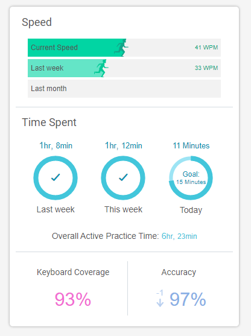
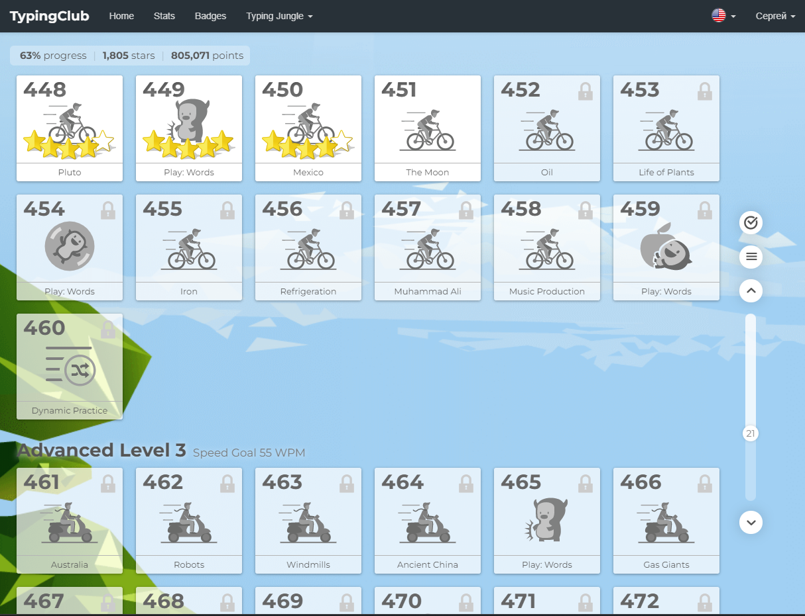

# Week 2

## Original exercise brief:

---

### Touch Typing

You should develop your touch typing skills through the term. In particular, you should do the following:

- Do an online typing test with your default typing style using websites such as [TypingAcademy](https://www.typing.academy/typing-tutor/typing-test). Write down the results in the following table.
- Start doing online touch typing exercises using websites such as [TypingClub](https://www.typingclub.com/).
- Keep doing the exercises and updating the following table until the end of the term. Present the table and discuss your progress in your final assignment.

| Date | Words per Minute | Error Rate |
| ---- | ---------------- | ---------- |
|06-06-2023|55.2|2.72|
|12-06-2023|57.2|1.57|
|      |                  |            |
|      |                  |            |
|      |                  |            |

---

Unfortunately (for me) I haven't updated this table, but I had actually done touch typing practice daily
during the whole module period (and I am planning to continue).

#### Edclub stats on 02/06/2023

#### Edclub progress on 02/06/2023

